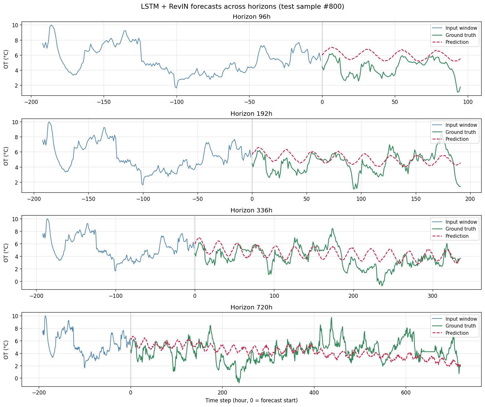

# ETTh1 LSTM Forecasting

Multi-step time series forecasting on the **ETTh1** (Electricity Transformer Temperature) dataset using a from-scratch **LSTM with reversible instance normalization (RevIN)** in PyTorch.

The task: predict the Oil Temperature (`OT`) of an industrial electrical transformer, up to 30 days ahead, from 8 days of hourly history.

## Results at a glance

| Horizon | MSE (normalized) | MAE (°C) |
|--------:|-----------------:|---------:|
|      96 |           0.0557 |     1.63 |
|     192 |           0.0736 |     1.92 |
|     336 |           0.0835 |     2.08 |
|     720 |           0.0980 |     2.27 |

These results are within the range of recent competitive models on this benchmark (DLinear, RLinear, PatchTST, iTransformer), illustrating the empirical finding from the literature that on long-term forecasting benchmarks, **proper handling of distribution shift via instance normalization (RevIN) accounts for most of the gain, regardless of model architecture**.


<sub>*Predictions on a single test sample (#800) across the four standard ETTh1 horizons. The model captures level and daily seasonality consistently; quality degrades smoothly with horizon length.*</sub>

## Project structure

```
etth1-lstm-forecasting/
├── checkpoints/             # Best model per horizon (git-ignored)
├── logs/                    # TensorBoard logs (git-ignored)
├── results/                 # Evaluation artifacts (git-ignored)
├── data/raw/                # ETTh1.csv (git-ignored, see Setup)
├── docs/images/             # Figures showcased in this README
├── notebooks/               # EDA notebook
├── src/
│   ├── data.py              # Loading, splits, scaler, sliding windows
│   ├── model.py             # LSTMForecaster with RevIN
│   ├── training.py          # Training & validation loops
│   ├── evaluation.py        # Metrics & plotting helpers
│   └── utils.py             # Seed, device, logger, config loader
├── configs/                 # One YAML per forecast horizon (96, 192, 336, 720)
├── scripts/                 # Multi-horizon visualization
├── train.py                 # Entry point: training
├── evaluate.py              # Entry point: test-set evaluation
└── requirements.txt
```

## Setup

### 1. Clone the repository

```bash
git clone https://github.com/Nestallum/etth1-lstm-forecasting.git
cd etth1-lstm-forecasting
```

### 2. Create and activate a virtual environment

```bash
python -m venv .venv
.venv\Scripts\activate         # Windows
source .venv/bin/activate      # macOS/Linux
```

### 3. Install dependencies

```bash
pip install torch --index-url https://download.pytorch.org/whl/cu130
pip install -r requirements.txt
```

The `cu130` index targets PyTorch with CUDA 13.0 support, required for NVIDIA Blackwell GPUs (RTX 50 series, sm_120). Adjust to your hardware if needed (see [PyTorch installation guide](https://pytorch.org/get-started/locally/)). For CPU-only, skip the first command.

### 4. Download the dataset

```bash
curl -o data/raw/ETTh1.csv https://raw.githubusercontent.com/zhouhaoyi/ETDataset/main/ETT-small/ETTh1.csv
```

## Usage

### Training

Train one model per horizon:

```bash
python train.py --config configs/horizon_96.yaml
python train.py --config configs/horizon_192.yaml
python train.py --config configs/horizon_336.yaml
python train.py --config configs/horizon_720.yaml
```

Each run saves the best checkpoint (by validation loss) to `checkpoints/h{H}/best.pt` and logs training curves to TensorBoard:

```bash
tensorboard --logdir logs
```

### Evaluation

```bash
python evaluate.py --config configs/horizon_96.yaml
```

Outputs test-set metrics (`results/h{H}/test_metrics.json`) in both normalized and °C-denormalized spaces.

### Multi-horizon comparison figure

After training all four models:

```bash
python scripts/compare_horizons.py --sample-index 800
```

Saves a 4-panel comparison plot to `docs/images/horizons_comparison.png`.

## Method

### Data pipeline

- **Splits.** 12 months train / 4 months validation / 4 months test, following the [Informer convention](https://arxiv.org/abs/2012.07436) introduced by Zhou et al. (2021), with months counted as 30-day blocks. The test set is held out from any preprocessing decision.
- **Normalization.** A `StandardScaler` is fitted on the training split only, then applied identically to validation and test sets to prevent data leakage.
- **Sliding windows.** Each sample is a pair `(input_window, target_window)` of shape `(192, 1)` and `(horizon,)` respectively, generated with stride 1.

### Model

A stacked LSTM encoder followed by a linear projection head:

1. **Input** of shape `(batch, 192, 1)` — 192 hours of OT history.
2. **RevIN normalization** (per-instance): each input window is z-scored using its own mean and std.
3. **LSTM encoder** with `hidden_size=128`, `num_layers=2`, `dropout=0.2`, `batch_first=True`.
4. **Last hidden state** of the top layer, shape `(batch, 128)`, used as a fixed-size summary of the input window.
5. **Linear head** projecting `(batch, 128) → (batch, horizon)`.
6. **RevIN denormalization** with the same per-instance statistics, restoring the prediction to the input's scale.

The model totals ~211k parameters.

### Reversible Instance Normalization (RevIN)

Each input window is z-scored using its own mean and std before entering the LSTM, and the prediction is rescaled with the same statistics. This addresses the distribution shift between training and inference periods — a well-known weakness of standard normalization on long-term forecasting benchmarks ([Kim et al., ICLR 2022](https://openreview.net/forum?id=cGDAkQo1C0p)).

The impact is dramatic. With identical architecture and hyperparameters at horizon 96:

| Configuration              | Test MSE (normalized) | Test MAE (°C) |
|----------------------------|----------------------:|--------------:|
| LSTM baseline (no RevIN)   |                 0.196 |          3.33 |
| **LSTM + RevIN (final)**   |             **0.056** |      **1.63** |

A ~3.5× reduction in MSE from a parameter-free, plug-and-play normalization. On this benchmark, this single change is more impactful than any architectural variant tested.

### Training setup

- **Optimizer.** AdamW with `lr = 1e-3`, no weight decay.
- **Loss.** Mean squared error in the normalized space.
- **Regularization.** Dropout 0.2 between LSTM layers, gradient clipping (max norm 1.0), early stopping on validation loss (patience 5–8 depending on horizon).
- **Reproducibility.** All RNG sources (Python, NumPy, PyTorch CPU/CUDA, `PYTHONHASHSEED`) are seeded.

## Limitations and observations

- The model captures level and daily seasonality reliably, but tends to **smooth out high-frequency variations and rare extreme events**, especially at long horizons. This is a known characteristic of LSTM trained with MSE loss on continuous-valued targets.
- RevIN occasionally produces **slightly exaggerated oscillations** at long horizons, a side effect of letting the model focus exclusively on relative dynamics. The net effect on metrics is overwhelmingly positive.
- Univariate setup only. Adding the other six ETTh1 features (multivariate input → univariate output) is a natural extension that would likely yield further gains.

## References

- Zhou, H. et al. (2021). [Informer: Beyond Efficient Transformer for Long Sequence Time-Series Forecasting](https://arxiv.org/abs/2012.07436). AAAI 2021. *(Benchmark conventions and ETTh1 dataset.)*
- Kim, T. et al. (2022). [Reversible Instance Normalization for Accurate Time-Series Forecasting against Distribution Shift](https://openreview.net/forum?id=cGDAkQo1C0p). ICLR 2022. *(RevIN.)*
- Zeng, A. et al. (2022). [Are Transformers Effective for Time Series Forecasting?](https://arxiv.org/abs/2205.13504) AAAI 2023. *(Linear baselines competitive with Transformers.)*
- Han, L. et al. (2024). [The Capacity and Robustness Trade-off: Revisiting the Channel Independent Strategy for Multivariate Time Series Forecasting](https://arxiv.org/abs/2304.05206). *(RLinear.)*

## License

MIT